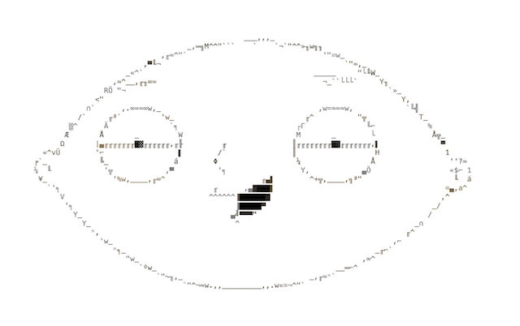

# Stewie



A TypeScript web framework with fine-grained signal-based reactivity, server-side rendering, and a clean monorepo architecture. No virtual DOM.

> **Work in progress.** Stewie is under active development and not yet stable. APIs may change between releases. Not recommended for production use yet.

---

## Packages

| Package | Description |
|---|---|
| [`@stewie-js/core`](packages/core) | Signals, computed, effects, store, JSX runtime, context, control flow, hydration |
| [`@stewie-js/server`](packages/server) | `renderToString` and `renderToStream` — WinterCG-compatible SSR |
| [`@stewie-js/router`](packages/router) | Reactive URL-as-store routing with `<Router>`, `<Route>`, `<Link>` |
| [`@stewie-js/vite`](packages/vite) | Vite plugin — JSX transform, HMR |
| [`@stewie-js/adapter-node`](packages/adapter-node) | Node.js HTTP adapter |
| [`@stewie-js/adapter-bun`](packages/adapter-bun) | Bun HTTP adapter |
| [`@stewie-js/testing`](packages/testing) | `mount`, DOM queries, signal assertions, SSR helpers |
| [`@stewie-js/compiler`](packages/compiler) | TSX → fine-grained reactive output compiler |
| [`create-stewie`](packages/create-stewie) | Project scaffolding CLI |

---

## Quick Start

```bash
pnpm create stewie my-app
cd my-app
pnpm install
pnpm dev
```

---

## Core Concepts

### Signals

```tsx
import { signal, computed, effect } from '@stewie-js/core'

const count = signal(0)
const doubled = computed(() => count() * 2)

effect(() => {
  console.log('count:', count(), 'doubled:', doubled())
})

count.set(5) // logs: count: 5 doubled: 10
```

### Store

```tsx
import { store } from '@stewie-js/core'

const state = store({ user: { name: 'Alice', age: 30 }, todos: [] as string[] })

// Components only re-render when the specific property they read changes
state.user.name = 'Bob'
state.todos.push('Learn Stewie')
```

### Components & JSX

```tsx
import { signal } from '@stewie-js/core'
import { Show, For } from '@stewie-js/core'

function Counter() {
  const count = signal(0)

  return (
    <div>
      <p>Count: {count}</p>
      <button onClick={() => count.update(n => n + 1)}>+</button>
    </div>
  )
}

function TodoList({ items }: { items: string[] }) {
  const show = signal(true)

  return (
    <div>
      <Show when={show}>
        <For each={() => items}>
          {(item) => <li>{item}</li>}
        </For>
      </Show>
    </div>
  )
}
```

### Context

```tsx
import { createContext, inject } from '@stewie-js/core'

const ThemeContext = createContext('light')

function App() {
  return (
    <ThemeContext.Provider value="dark">
      <Page />
    </ThemeContext.Provider>
  )
}

function Page() {
  const theme = inject(ThemeContext) // 'dark'
  return <div class={`theme-${theme}`}>...</div>
}
```

---

## Server-Side Rendering

`renderToString` returns `{ html, stateScript }` separately so you control where each lands in your document:

```tsx
// src/server.ts
import { renderToString } from '@stewie-js/server'
import { createNodeHandler } from '@stewie-js/adapter-node'
import { createServer } from 'node:http'
import { readFileSync } from 'node:fs'
import App from './App.js'
import { jsx } from '@stewie-js/core'

const template = readFileSync('dist/client/index.html', 'utf-8')

const handler = createNodeHandler(async (_req) => {
  const { html, stateScript } = await renderToString(jsx(App, {}))
  const page = template
    .replace('<!--ssr-outlet-->', html)
    .replace('</body>', `  ${stateScript}\n  </body>`)
  return new Response(page, { headers: { 'content-type': 'text/html; charset=utf-8' } })
})

createServer(handler).listen(3000)
```

```tsx
// src/client.tsx — hydrates the server-rendered HTML
import { hydrate } from '@stewie-js/core'
import App from './App.js'

hydrate(<App />, document.getElementById('app')!)
```

The `stateScript` injects `window.__STEWIE_STATE__` — a single serialized payload that `hydrate()` reads to initialize client state from server values, avoiding a second round-trip fetch.

---

## Routing

```tsx
import { Router, Route, Link, useRouter } from '@stewie-js/router'

function App() {
  return (
    <Router>
      <Route path="/" component={Home} />
      <Route path="/users/:id" component={UserDetail} />
    </Router>
  )
}

function UserDetail() {
  const router = useRouter()
  const id = () => router.location.params.id

  return (
    <div>
      <Link to="/">← Back</Link>
      <h1>User {id()}</h1>
    </div>
  )
}
```

---

## Vite Config

```ts
// vite.config.ts
import { stewie, defineConfig } from '@stewie-js/vite'

export default defineConfig({
  plugins: [stewie()]
})
```

---

## Development

```bash
pnpm install        # install all workspace deps
pnpm build          # build all packages
pnpm test           # run all tests
```

Per-package:

```bash
pnpm --filter @stewie-js/core build
pnpm --filter @stewie-js/core test
pnpm --filter ssr-and-routing dev
```

See [`examples/ssr-and-routing`](examples/ssr-and-routing) for a full SSR + routing example app.
